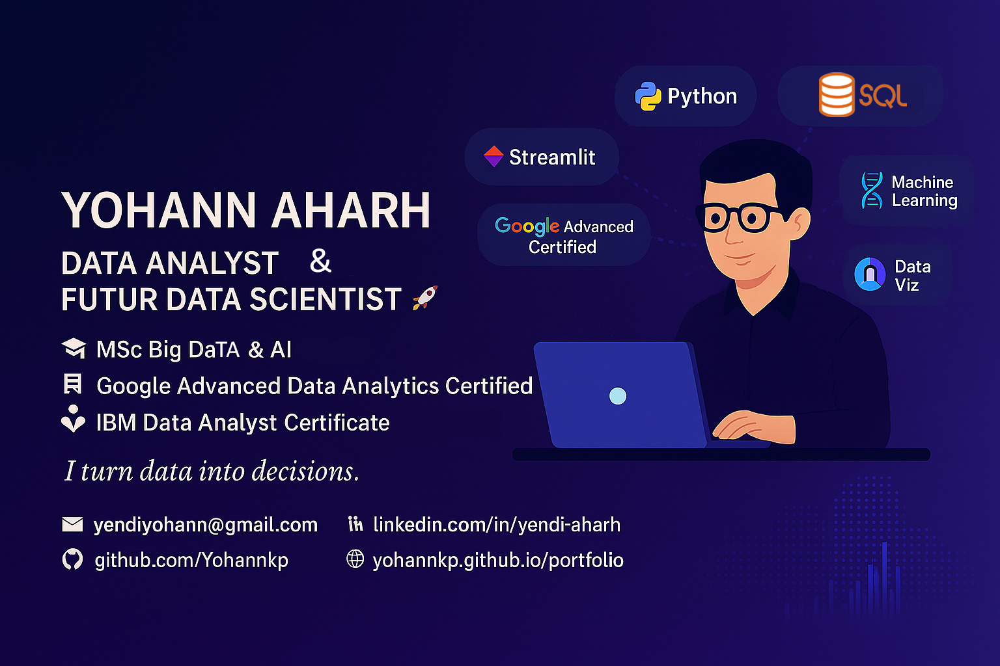

# 🙋🏿 A Propos de moi

# 👋 Bonjour, je suis Assiawassa Yendi plus communément appelé Yohann — Data Analyst & Futur Data Scientist

🎯 Actuellement en Master Big Data & IA , je combine une double expertise en **développement Fullstack / DevOps** et **analyse avancée des données**.  
Certifié Google Advanced Data Analytics, je mets mes compétences au service de la **visualisation, la prédiction et la prise de décision business**.

📍 Basé à Paris — ouvert aux alternances (1 sem. école / 3 sem. entreprise) et missions Data en France ou à distance.

---

## 🧠 Compétences techniques

- **Langages** : Python (Pandas, NumPy, Seaborn, Scikit-learn, XGBoost), SQL avancé, JavaScript, Bash
- **BI & visualisation** : Tableau, Power BI, Matplotlib, Streamlit
- **Machine Learning** : régression, classification, clustering, métriques (F1, ROC, AUC), t-SNE, PCA
- **Outils Data** : Jupyter, Git/GitHub, Google Sheets, Looker Studio, Excel
- **DevOps & déploiement** : Docker, GitHub Actions, CI/CD, API FastAPI
- **Soft Skills** : communication claire, vulgarisation, esprit analytique, autonomie, consulting data

---

## 📜 Certifications

- ✅ [Google Advanced Data Analytics Professional Certificate](https://www.credly.com/badges/8ed72404-fd7d-469e-9630-b75fe195b5fb/public_url)
- ✅ [Data Analysis & Visualization Foundations Specialization](https://www.credly.com/badges/f4d17383-ca2f-41ef-b96f-4ec67793c7b9/public_url)
- ✅ [Databases and SQL for Data Science](https://www.credly.com/badges/e79047b5-a040-474e-bbac-a12a781a4e1f/public_url)
- 📁 IBM Data Analyst (en cours)
- 📊 Microsoft Power BI (prévu)
- 🧠 Machine Learning Specialization – DeepLearning.AI (prévu)

---

## 🎓 Formation

- 🎓 Master Big Data & Intelligence Artificielle – IPSSI Paris *(2024–2027)*
- 🎓 Bachelor Dev Fullstack & DevOps – IPSSI *(Obtenu : 2023–2024)*
- 🎓 Bac+3 Génie Logiciel – Togo *(obtenu)*

---

## 🚀 Objectif

Je souhaite :
- Intégrer une entreprise en alternance ou CDI pour exploiter mes compétences en **analyse, prédiction et automatisation**
- Évoluer vers un poste de **Data Scientist** à moyen terme
- Travailler sur des **cas métiers concrets** à fort impact décisionnel

---
## Guide pour mes projets
Je vous ai fait un petit guide pour vous faciliter l'accès à mes différents projets :
[Guide Portfolio Projets](https://github.com/Yohannkp/Portfolio-Guide)  

---

## 📫 Me contacter

- 📧 yendiyohann@gmail.com  
- 📞 06 45 86 35 33  
- 💼 [LinkedIn](https://linkedin.com/in/yendi-aharh-a9b2992a8)  
- 🌐 [Portfolio](https://yohannkp.github.io/portfolio/)  
- 🐙 [GitHub](https://github.com/Yohannkp)

---

Merci de votre visite ! N'hésitez pas à explorer mes projets ou me contacter ✉️
