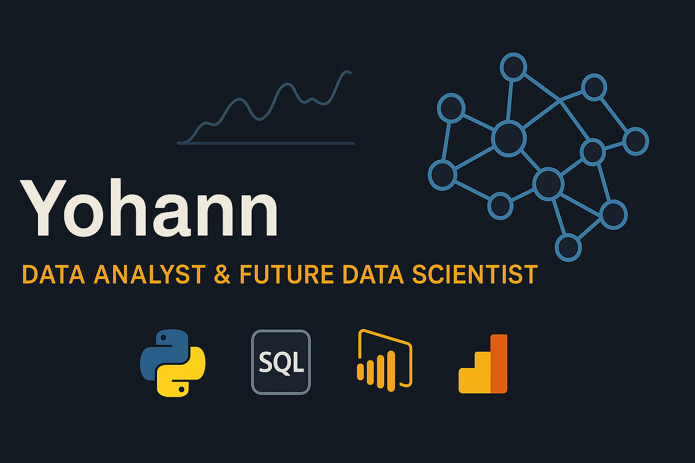

# A Propos de moi

# 👋 Bonjour, je suis Yohann — Data Analyst & Futur Data Scientist

🎯 Actuellement en Master 1 Big Data & IA , je combine une double expertise en **développement Fullstack / DevOps** et **analyse avancée des données**.  
Certifié Google Advanced Data Analytics, je mets mes compétences au service de la **visualisation, la prédiction et la prise de décision business**.

📍 Basé à Paris — ouvert aux alternances (1 sem. école / 3 sem. entreprise) et missions Data en France ou à distance.

---

## 🧠 Compétences techniques

- **Langages** : Python (Pandas, NumPy, Seaborn, Scikit-learn, XGBoost), SQL avancé, JavaScript, Bash
- **BI & visualisation** : Tableau, Power BI, Matplotlib, Streamlit
- **Machine Learning** : régression, classification, clustering, métriques (F1, ROC, AUC), t-SNE, PCA
- **Outils Data** : Jupyter, Git/GitHub, Google Sheets, Looker Studio
- **DevOps & déploiement** : Docker, GitHub Actions, CI/CD, API FastAPI
- **Soft Skills** : communication claire, vulgarisation, esprit analytique, autonomie, consulting data

---

## 📂 Projets clés (avec démos interactives)

| Projet | Description | Lien |
|--------|-------------|------|
| 🧪 **A/B Testing sur landing page (200k+ users)** | Test de conversion + analyse statistique (Chi², T-test) | [💻 App Streamlit](https://tests-statistiques-landing-page-gxdfuncfjkpxm9kfyzvafu.streamlit.app/) • [📁 Code GitHub](https://github.com/Yohannkp/Tests-Statistiques-Landing-Page.git) |
| 🧬 **Segmentation client & stratégie marketing** | Clustering ML avec visualisation t-SNE + recommandations | [💻 App Streamlit](https://analyse-marketing-zap5appepxyqkmjhtt3ovqi.streamlit.app/) • [📁 Code GitHub](https://github.com/Yohannkp/Analyse-Marketing.git) |
| 👥 **Prédiction du Turnover employés (HR Analytics)** | Modèle de prédiction + déploiement API + application | [💻 App Streamlit](https://projet-salifort-motors-app.streamlit.app/) • [📁 Code GitHub](https://github.com/Yohannkp/Projet-Salifort-Motors..git) |
| 🛍️ **Audit Data e-commerce local** | Analyse produit, retargeting & upsell via Tableau | *Projet confidentiel (visu sur demande)* |
| 📦 **Veille concurrentielle automatisée** | Scraping + bot Python + notifications email | *Projet privé (code disponible sur demande)* |

---

## 📜 Certifications

- ✅ [Google Advanced Data Analytics Professional Certificate](https://coursera.org/share/996430bde36afd3f6385cd27fa9251e4)
- 📊 Microsoft Power BI (en cours)
- 📁 IBM Data Analyst (prévu)
- 🧠 Machine Learning Specialization – DeepLearning.AI (prévu)

---

## 🎓 Formation

- 🎓 Master Big Data & Intelligence Artificielle – IPSSI Paris *(2024–2026)*
- 🎓 Bachelor Dev Fullstack & DevOps – IPSSI *(2023–2024)*
- 🎓 Bac+3 Génie Logiciel – Afrique *(obtenu)*

---

## 🚀 Objectif

Je souhaite :
- Intégrer une entreprise en alternance ou CDI pour exploiter mes compétences en **analyse, prédiction et automatisation**
- Évoluer vers un poste de **Data Scientist** à moyen terme
- Travailler sur des **cas métiers concrets** à fort impact décisionnel

---

## 📫 Me contacter

- 📧 yendiyohann@gmail.com  
- 📞 06 45 86 35 33  
- 💼 [LinkedIn](https://linkedin.com/in/yendi-aharh-a9b2992a8)  
- 🌐 [Portfolio](https://yohannkp.github.io/portfolio/)  
- 🐙 [GitHub](https://github.com/Yohannkp)

---

Merci de votre visite ! N'hésitez pas à explorer mes projets ou me contacter ✉️
