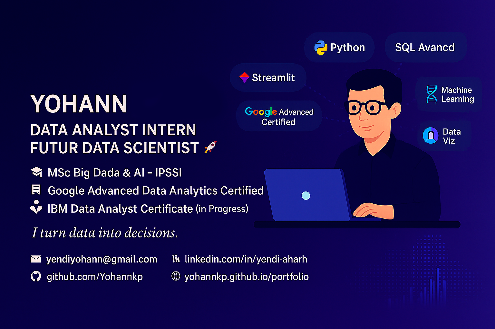

# 👋 Bonjour, je suis Yohann
## Data Analyst / Scientist

---

🯠<b>Actuellement en cycle ingénieur Data & IA</b>, je combine une double expertise en <b>développement Fullstack / DevOps</b> et <b>analyse avancée des données</b>. 
Certifié Google Advanced Data Analytics, je mets mes compétences au service de la <b>visualisation, la prédiction et la prise de décision business</b>.

📍 <b>Basé à Paris</b> — ouvert aux alternances (1 sem. école / 3 sem. entreprise) et missions Data en France ou à distance.

---

## 🧠 Compétences techniques

	
<b>Langages</b>

	Python (Pandas, NumPy, Seaborn, Scikit-learn, XGBoost), SQL avancé, JavaScript, Bash

	
<b>BI & Visualisation</b>

	Tableau, Power BI, Matplotlib, Streamlit

	
<b>Machine Learning</b>

	Régression, classification, clustering, métriques (F1, ROC, AUC), t-SNE, PCA

	
<b>Outils Data</b>

	Jupyter, Git/GitHub, Google Sheets, Looker Studio, Excel

	
<b>DevOps & Déploiement</b>

	Docker, GitHub Actions, CI/CD, API FastAPI

	
<b>Soft Skills</b>

	Communication claire, vulgarisation, esprit analytique, autonomie, consulting data

---

## 📜 Certifications

<ul>
	<li>✅ <a href="https://www.credly.com/badges/8ed72404-fd7d-469e-9630-b75fe195b5fb/public_url">Google Advanced Data Analytics Professional Certificate</a></li>
	<li>✅ <a href="https://www.credly.com/badges/f4d17383-ca2f-41ef-b96f-4ec67793c7b9/public_url">Data Analysis & Visualization Foundations Specialization</a></li>
	<li>✅ <a href="https://www.credly.com/badges/e79047b5-a040-474e-bbac-a12a781a4e1f/public_url">Databases and SQL for Data Science</a></li>
	<li>✅ <a href="https://www.credly.com/badges/13e0b9e8-eedf-4d96-95ae-b6dc42e4da21/public_url">Data Analysis with Python</a></li>
	<li>✅ <a href="https://coursera.org/share/a5621fd86d60f201e5934276ce2cb519">IBM Data Analyst Professional Certificate</a></li>
	<li>🧠 Machine Learning Specialization – DeepLearning.AI (prévu)</li>
</ul>

---

## 🎓 Formation

<ul>
	<li>🎓 Cycle Ingénieur Data et IA – ECE Paris <i>(2025–2028)</i></li>
	<li>🎓 Master 1 Big Data & Intelligence Artificielle – IPSSI Paris <i>(2024–2025)</i></li>
	<li>🎓 Bachelor Dev Fullstack & DevOps – IPSSI <i>(2023–2024)</i></li>
	<li>🎓 Bac+3 Génie Logiciel – Togo <i>(2020–2023)</i></li>
</ul>

---

## 🚀 Objectif

<ul>
	<li>Intégrer une entreprise en alternance ou CDI pour exploiter mes compétences en <b>analyse, prédiction et automatisation</b></li>
	<li>Évoluer vers un poste de <b>Data Scientist</b> à moyen terme</li>
	<li>Travailler sur des <b>cas métiers concrets</b> à fort impact décisionnel</li>
</ul>

---

## 📁 Guide & Projets

🔗 <b>Accédez à tous mes projets :</b> <a href="https://github.com/Yohannkp/Portfolio-Guide">Guide Portfolio Projets</a>

---

## 📫 Me contacter

<ul>
	<li>📧 <b>Email :</b> <a href="mailto:yendiyohann@gmail.com">yendiyohann@gmail.com</a></li>
	<li>📞 <b>Téléphone :</b> 06 45 86 35 33</li>
	<li>💼 <b>LinkedIn :</b> <a href="https://www.linkedin.com/in/yendi-aharh-data-scientist-alternance-paris-contrat-apprentissage-dataanalyst-datascientist-data/">Profil LinkedIn</a></li>
	<li>🌐 <b>Portfolio :</b> <a href="https://www.datascienceportfol.io/yendiyohann">datascienceportfol.io/yendiyohann</a></li>
	<li>🐙 <b>GitHub :</b> <a href="https://github.com/Yohannkp">Yohannkp</a></li>
</ul>

---

	<b>Merci de votre visite !</b>  N'hésitez pas à explorer mes projets ou me contacter ✉️

